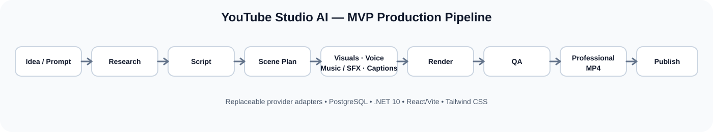

# YouTube Studio AI

> **AI Media Company OS** — from an idea to a professional video, then from performance data to the next better idea.



YouTube Studio AI is being built as an AI-native operating system for creating, producing, publishing and improving original YouTube content at scale.

The core experience is deliberately simple:

**Idea / Prompt → Research → Script → Scene Plan → Visuals → Voice → Music/SFX → Captions → Edit/Render → QA → Professional MP4**

---

## Product vision

The project is designed to become a **company platform**, not just a video generator.

### Business loop

```text
FIND → RESEARCH → CREATE → PRODUCE → PUBLISH → MEASURE → LEARN → MONETIZE → SCALE
```

The primary optimization target is **net business value per published video**, not simply the number of videos or views.

### Core product areas

- **Market Intelligence** — trends, demand, competition, search intent and monetization signals.
- **Opportunity Engine** — identify and score promising content opportunities.
- **AI Research** — collect sources, evidence and claims with provenance.
- **Content Engine** — turn validated opportunities into briefs, scripts and scene plans.
- **Video Production** — generate and assemble visuals, voice, music/SFX, captions and final renders.
- **YouTube OS** — publishing, scheduling, channel management and platform analytics.
- **Community AI** — authorized comment intelligence and audience feedback loops.
- **Analytics Intelligence** — understand what changed, why it changed and what to do next.
- **Revenue Engine** — connect content performance to ads, affiliate, sponsorships, products and other revenue streams.
- **AI CEO / AI CFO** — strategic and financial decision support.
- **Learning Loop** — Content Genome + Opportunity Graph + historical performance data.

---

## Current status

The repository has completed the **v0.1 MVP foundation / vertical slice**. The production loop is now verified in CI against PostgreSQL/pgvector, including Create → Start → Worker → persisted artifacts, backend tests and frontend build.

The first objective was to prove a reliable production loop before adding large-scale automation or monetization features.

### v0.1 implementation checklist

Legend: **[x] completed and verified**, **[~] implemented but verification/DoD still pending**, **[ ] not yet completed**.

#### Foundation — Workspace & Channel

- [x] ASP.NET Core / .NET 10 backend
- [x] C# domain model
- [x] PostgreSQL + Entity Framework Core
- [x] Workspace creation and persistence
- [x] Channel creation and persistence
- [x] Workspace/channel isolation and validation tests
- [x] Versioned REST API under `/api/v1`
- [x] Health check endpoint
- [x] Swagger in development
- [x] PostgreSQL migration verification in CI
- [x] Backend build in GitHub Actions
- [x] Frontend build in GitHub Actions
- [x] Backend test diagnostics in CI

#### Video creation vertical slice

- [x] VideoProject model and API
- [x] Prompt validation
- [x] Workspace validation
- [x] Channel-to-workspace validation
- [x] `Draft → Researching → Scripted → Planned → Producing → Rendering → QA → Completed` pipeline states
- [x] Persistent production jobs
- [x] Production job enqueue service
- [x] Provider abstraction boundaries
- [x] Research provider boundary
- [x] Script provider boundary
- [x] Scene-plan provider boundary
- [x] Voice provider boundary
- [x] Visual provider boundary
- [x] Music/SFX provider boundary
- [x] Caption provider boundary
- [x] Render provider boundary
- [x] QA provider boundary
- [x] Production artifacts persistence
- [x] Pipeline artifact API
- [x] Create Video frontend flow
- [x] Pipeline progress polling in frontend
- [x] Generated artifacts shown in frontend
- [x] User-facing pipeline labels
- [x] End-to-end Create → Start → Worker → Artifacts verification
- [x] Final v0.1 Definition of Done

### What is implemented

- ASP.NET Core / .NET 10 backend
- C# domain model
- PostgreSQL + Entity Framework Core
- Workspace and channel foundations
- Opportunity model and API
- VideoProject model and API
- Persistent production jobs
- Video production job enqueue service
- Provider abstraction layer for research, script, scene planning, voice, visuals, music/SFX, captions, rendering and QA
- React + Vite + TypeScript frontend foundation
- Tailwind CSS
- Backend unit tests for the first video-project slice

### Current video pipeline

```text
Draft
  ↓
Researching
  ↓
Scripted
  ↓
Planned
  ↓
Producing
  ↓
  Voice + Visuals + Music/SFX
  ↓
Rendering
  ↓
QA
  ↓
Completed
```

The current implementation uses placeholders and provider interfaces where real AI credentials are not yet required. This keeps the architecture replaceable and testable while the core workflow is built. Music/SFX is represented as its own provider boundary and persisted production artifact before rendering.

---

## Agile implementation plan

The project is executed **incrementally and in dependency order**. A release is not considered complete until its acceptance criteria, tests, CI and Definition of Done are verified.

### Release roadmap

| Status | Release | Scope |
|---|---|---|
| [x] | **v0.1** | Foundation + video creation vertical slice |
| [x] | **v0.2** | Opportunity Engine |
| [~] | **v0.3** | Research Engine — project and source workspace in progress |
| [ ] | **v0.4** | Fact Check |
| [ ] | **v0.5** | Content Engine |
| [ ] | **v0.6** | AI Provider Layer |
| [ ] | **v0.7** | Production Engine hardening |
| [ ] | **v0.8** | Complete video pipeline |
| [ ] | **v1.0** | MVP production loop |
| [ ] | **v1.x** | YouTube publishing, analytics and learning loop |
| [ ] | **v2.0** | YouTube OS |
| [ ] | **v3.0** | Autonomous Creator / Creator Business OS |

### v0.1 — Definition of Done checklist

- [x] Backend starts and compiles on .NET 10
- [x] Frontend starts and compiles with Vite/React/TypeScript
- [x] PostgreSQL connectivity configured through application configuration
- [x] EF Core migrations exist and are exercised against PostgreSQL in CI
- [x] Workspace and channel persistence implemented
- [x] VideoProject persistence implemented
- [x] ProductionJob persistence implemented
- [x] ProductionArtifact persistence implemented
- [x] REST API versioned under `/api/v1`
- [x] Prompt/input validation implemented
- [x] Workspace/channel reference validation implemented
- [x] Provider interfaces keep vendors replaceable
- [x] No provider secrets exposed in browser code
- [x] Create Video flow implemented
- [x] Pipeline status exposed by API
- [x] Pipeline artifacts exposed by API
- [x] Pipeline artifacts surfaced by frontend
- [x] Unit tests cover the foundation and video-project slice
- [x] Full end-to-end Create Video acceptance test in CI
- [x] Final CI run green after the latest vertical-slice changes
- [x] v0.1 release/Issue Definition of Done formally closed

### Completed implementation history

- [x] Workspace/channel foundation and validation tests
- [x] VideoProject creation and validation
- [x] Production job persistence and enqueue flow
- [x] Provider adapter boundaries for the full production journey
- [x] Music/SFX stage added to the production worker
- [x] Pipeline artifact retrieval API
- [x] Frontend artifact display and pipeline labels
- [x] CI PostgreSQL migration gate
- [x] CI backend test diagnostics and reports
- [x] CI/test-project compatibility fixes
- [x] Validation-test corrections aligned with ASP.NET Core controller behavior
- [x] README pipeline image and implementation checklist
- [x] Deterministic EF/Npgsql PostgreSQL 17 model configuration for CI migrations
- [x] Final CI verification of the Create → Start → Worker → Artifacts production loop

### Next work, in strict order

1. **[x] v0.1 — close end-to-end/DoD verification.**
2. **[x] v0.2 — Opportunity Engine**: workspace-scoped opportunity CRUD, sorting, validation and dashboard integration are complete.
3. **[~] v0.3 — Research Engine**: research projects and source storage are implemented; claims, verification and evidence-backed briefs remain.
4. **[ ] v0.4+ — continue through the dependency chain toward v1.0.**

> **Rule:** do not start unrelated 2027–2030 work while the MVP production loop is incomplete.

---

## Technology stack

### Frontend

- Vite
- React
- TypeScript
- Tailwind CSS
- React Router
- TanStack Query
- Zustand

### Backend

- ASP.NET Core
- .NET 10
- C#
- Entity Framework Core
- PostgreSQL
- pgvector
- Background worker / production queue

### Architecture

- Modular backend
- Provider interfaces / adapters
- Replaceable AI providers
- Workspace isolation
- API-first contracts
- Persistent production jobs and artifacts
- CI-backed PostgreSQL integration verification
