# UI/UX Image Gallery

This folder contains the visual reference screens for YouTube Studio AI.

> GitHub may display an SVG file as source code depending on the viewer. This README is the canonical visual index: each image is embedded below so the screens can be reviewed from one page.

## Desktop screens

### 01 — Dashboard
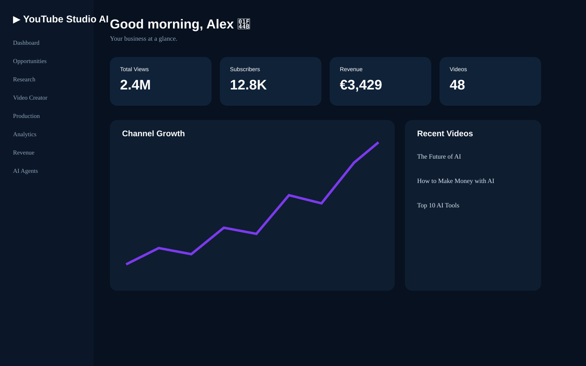

### 02 — Opportunities
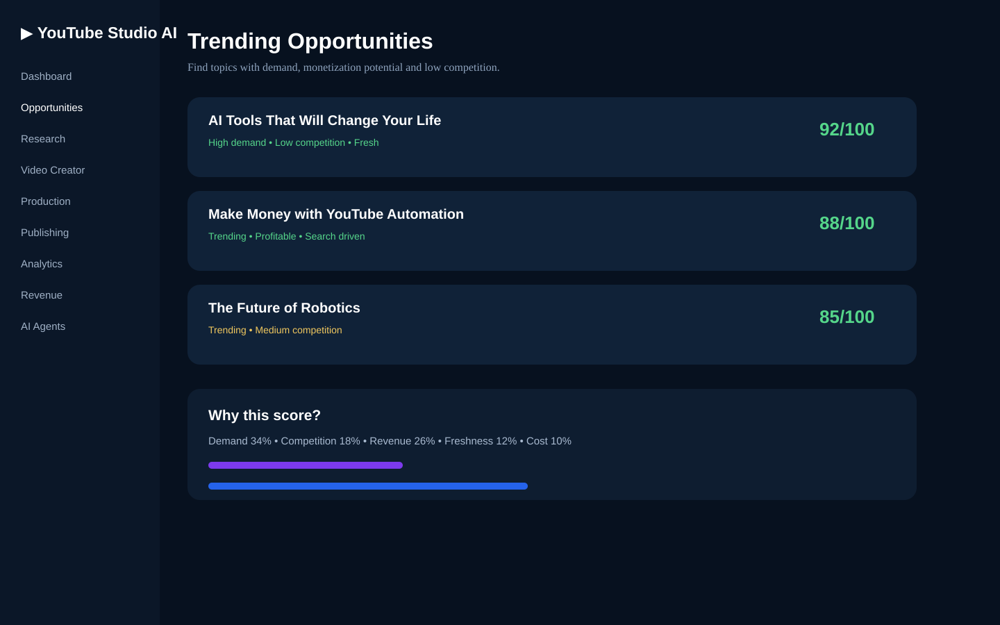

### 03 — Research
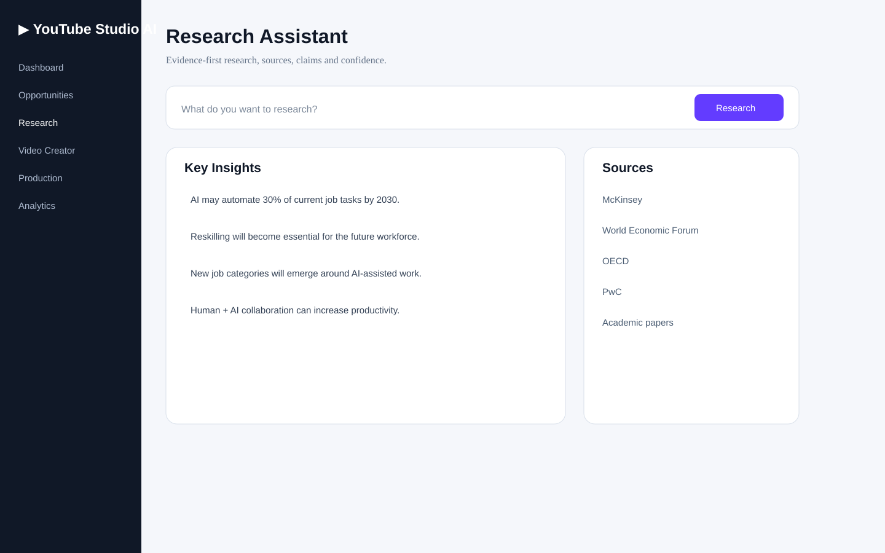

### 04 — Video Creator
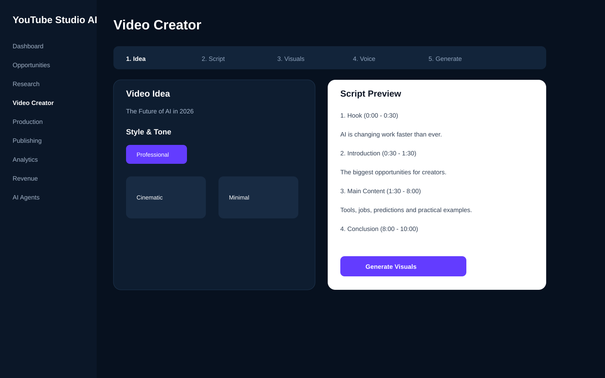

### 05 — Production
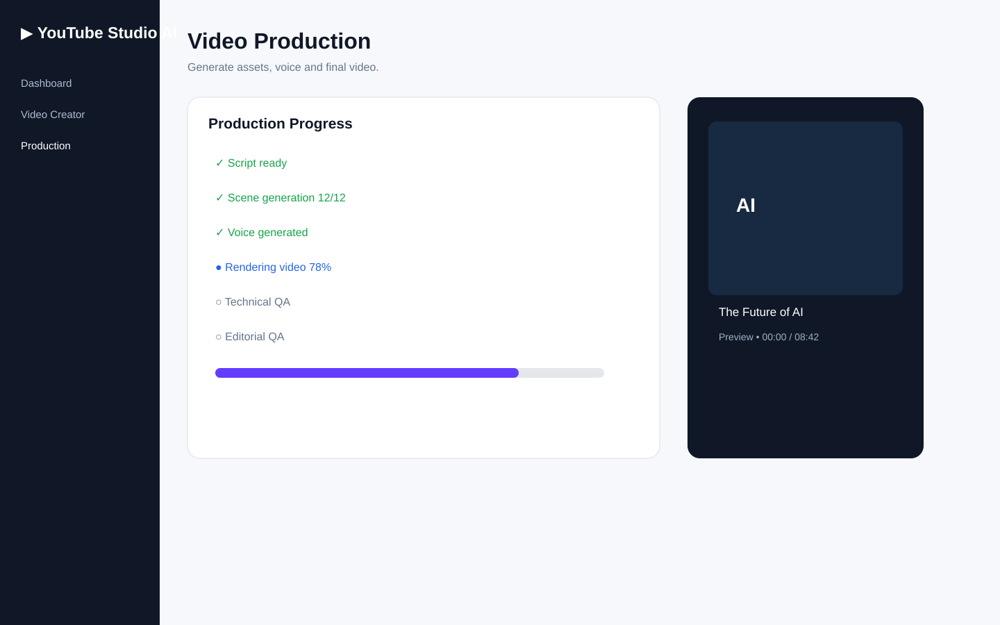

### 06 — Publishing
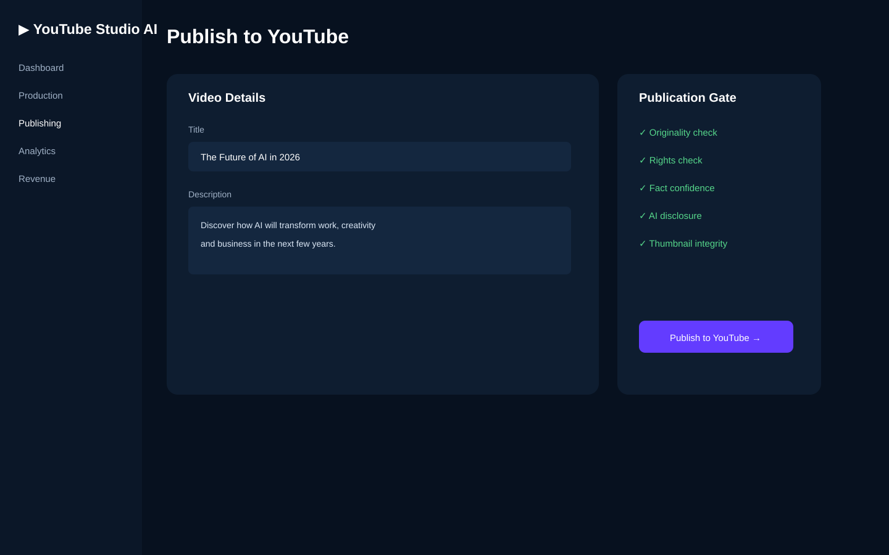

### 07 — Analytics
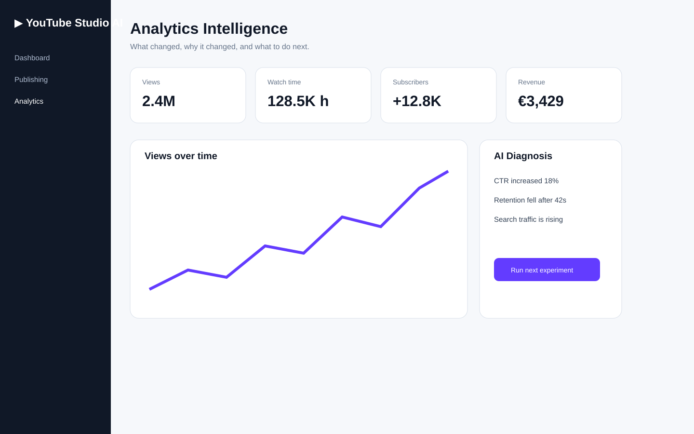

### 08 — Revenue
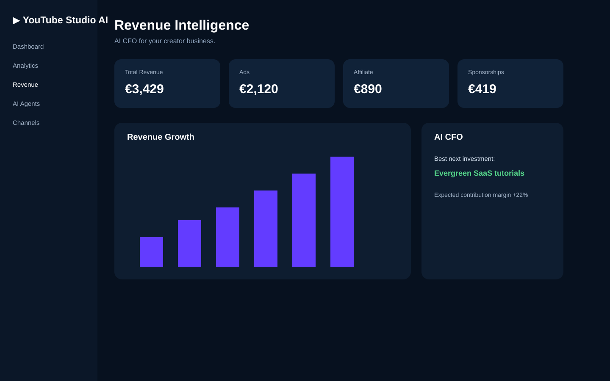

### 09 — AI Agents
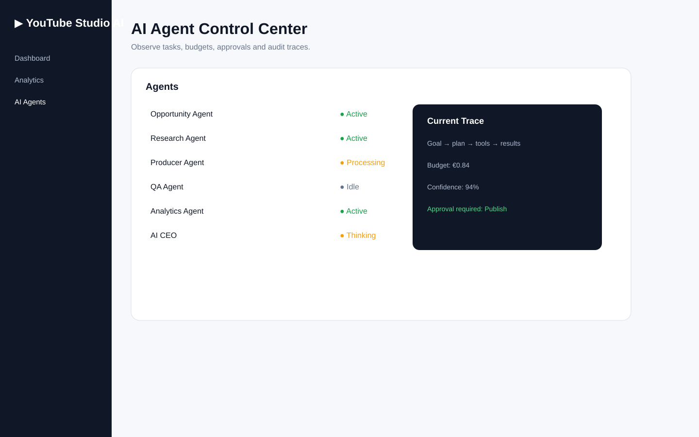

### 10 — Channels
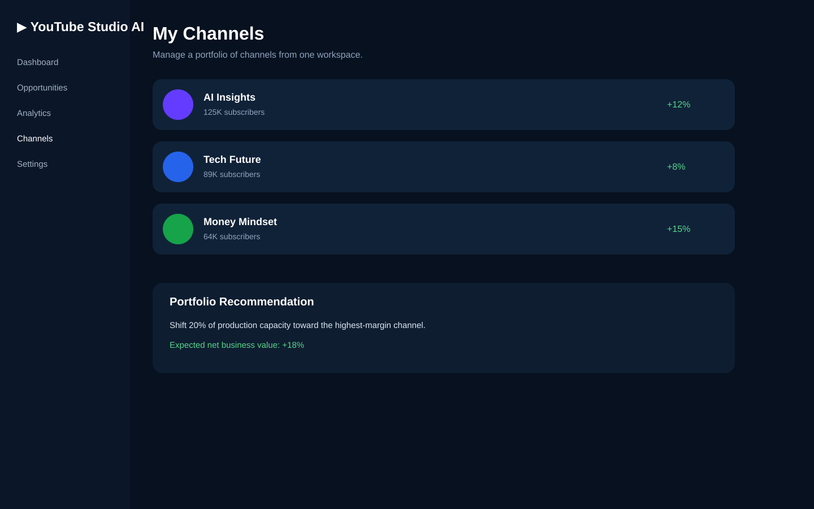

### 11 — Settings
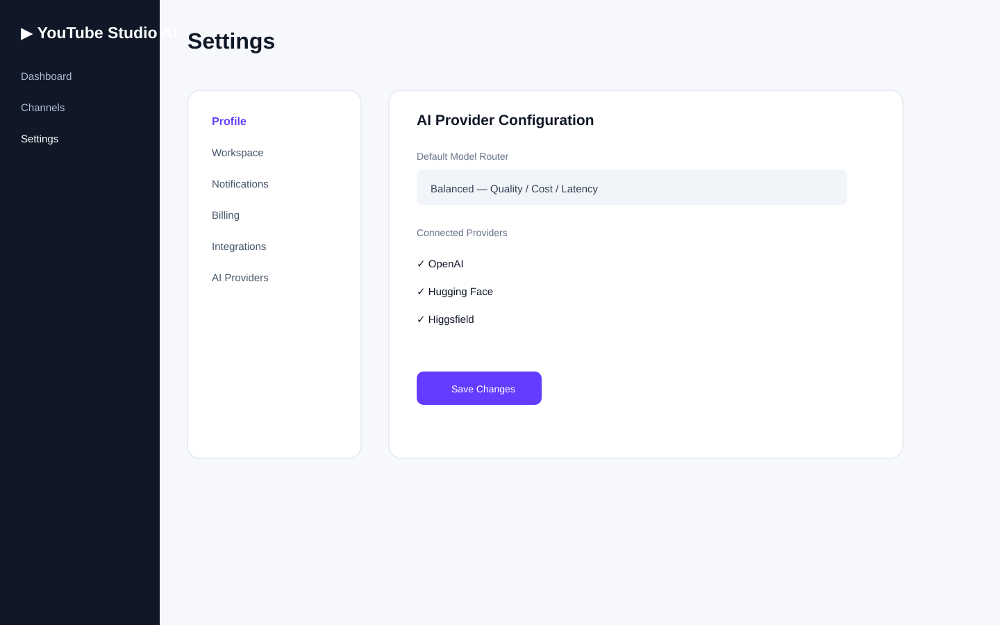

### 12 — Onboarding
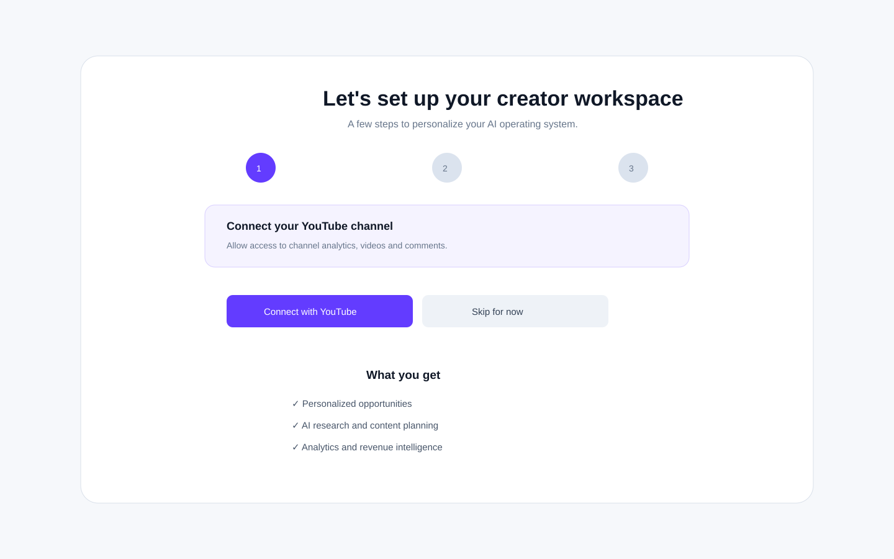

### 13 — Mobile

### 14 — Design System

## Asset rules

- SVG is the source-of-truth format for UI mockups because it is versionable and renders at any resolution.
- Production UI must not copy mockup SVG markup directly; the mockups are visual specifications.
- The frontend component library is the implementation source of truth.
- New screens should be added here only after their UX flow and component requirements are documented.
